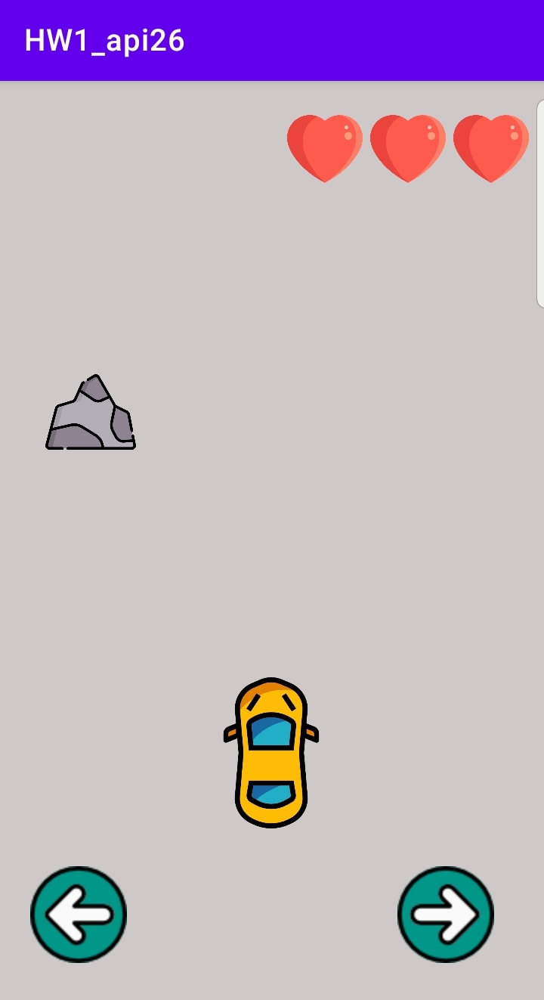

# Car_Game_Version-1.0

Car game is the first assignment that was required in the course 'Introduction To Cellular Sciences'. 

The game was built using java in android studio.

The features that the game has is: 

1- Vibrating when the car crashes with the stone.

2- Toast message when the car crashes.

## Game Page

